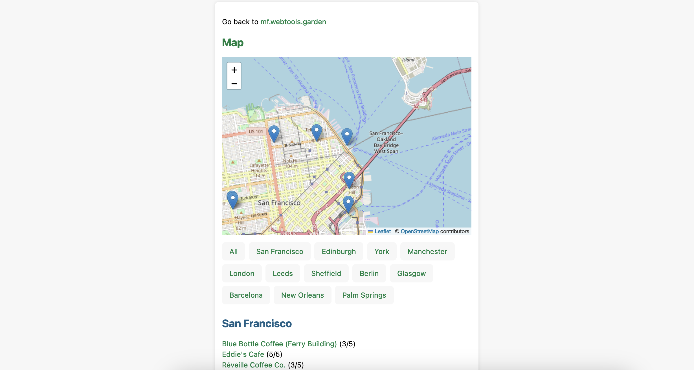

# maps.webtools.garden

[https://maps.webtools.garden](https://maps.webtools.garden) generates a web page for a [h-review](https://microformats.org/wiki/h-review). If multiple h-reviews are on a page, an aggregate page can be generated that lets you view all the reviews on a single page.

maps.webtools.garden adds a map if a h-geo is specified in a review.

## License

This project is licensed under an [MIT license](LICENSE).

## Contributors

- capjamesg